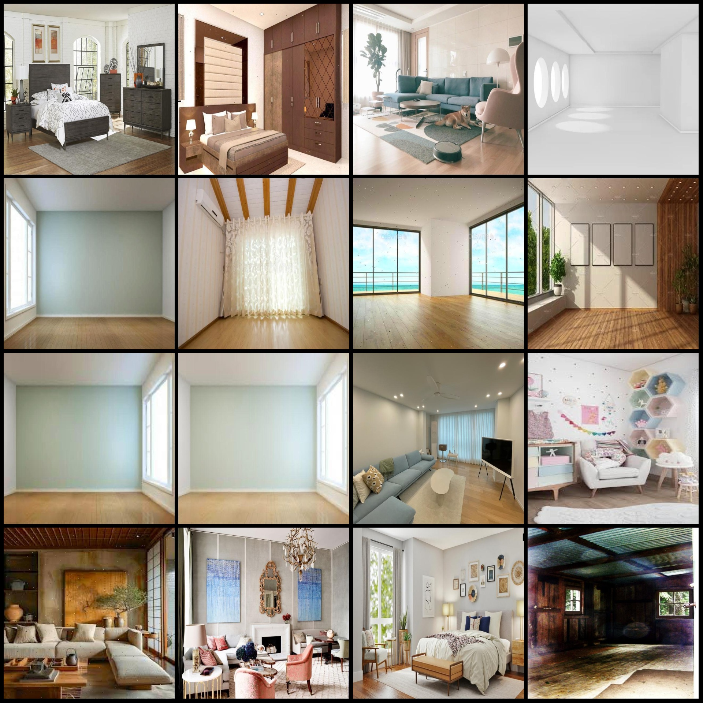
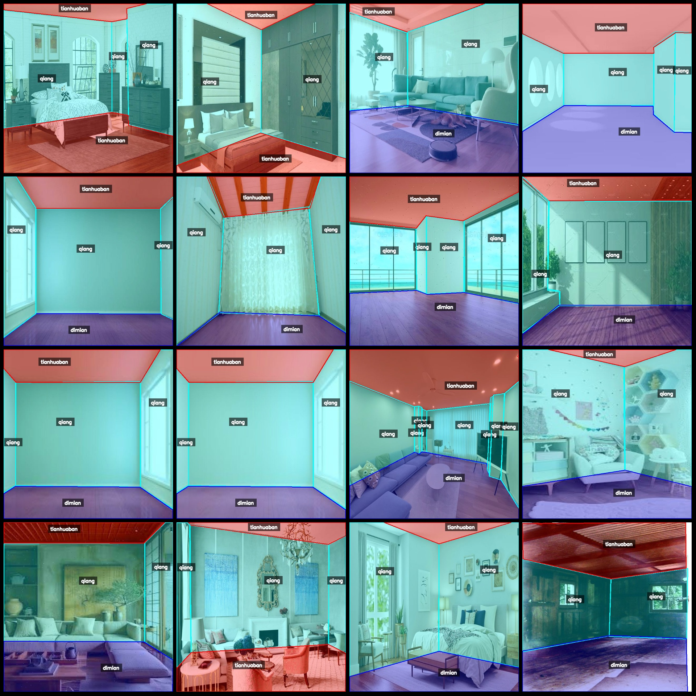
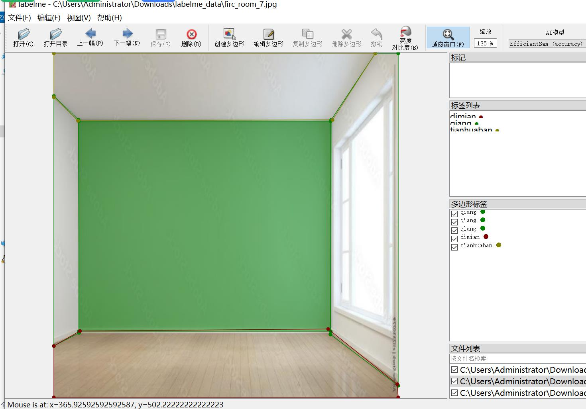

# Indoor Element Recognition: Building Inside Ground, Wall, Ceiling Identification and Segmentation Data Set - LabelMe Format
1031 images with 3 categories

Note: Approximately one-third of the images in the dataset are originals, while the remaining are enhanced.
Dataset format: LabelMe (without mask files, only containing JPG images and corresponding JSON files)
Number of images (JPG file count): 1031
Annotation count (JSON file count): 1031
Number of annotation categories: 3
Annotation categories: ["dimian", "qiang", "tianhuaban"]
Each category has a specified number of bounding boxes:
dimian (ground) count = 964
qiang (wall) count = 2935
tianhuaban (ceiling) count = 985
Total bounding box count: 4884
Using annotation tool: labelme=5.5.0
Image resolution: 640x640
Annotation rules: Polygons for each category are drawn
Important note: The dataset can be opened and edited using LabelMe, but the JSON dataset needs to be converted into either Mask or Yolo format for instance segmentation or semantic segmentation.
Special declaration: This dataset does not provide any guarantees regarding the accuracy of the trained models or weight files.
Image preview:
Annotation example:
Random selection of 16 images:
Annotation drawing results:
LabelMe editing image example:

## Images

Here is a pay link on Stripe ( https://buy.stripe.com/3cs8yP7sY87d0vu9AB ). Please contact me lonlonago@foxmail.com after funding $89, and I will send you a complete data files , thank you!

